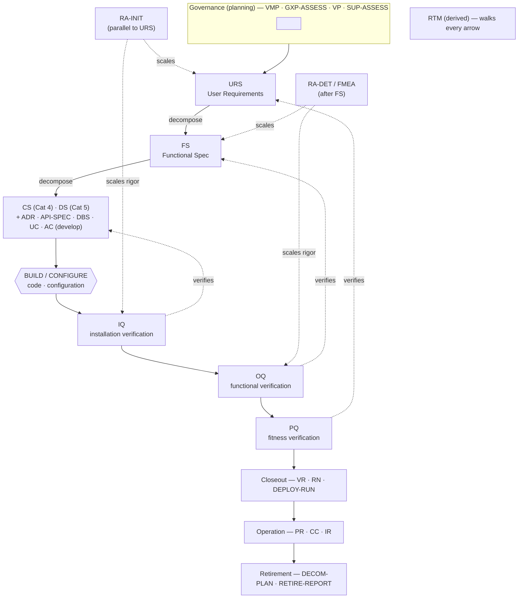

# V-Model — template-to-phase mapping with regulatory anchors

This document maps every canonical template in `gxp-driven-dev` onto the **V-Model lifecycle** and pins each one to its **GAMP 5 / 21 CFR Part 11 / EU Annex 11** anchor and its **traceability neighbours** (what it traces *from* and *to*).

The V-Model is the reference shape the toolkit ships with. It is **one valid shape, not a mandate**: ISPE GAMP 5 §3.2 (Figure 3.4) explicitly accepts iterative / Agile lifecycles, and the `.gxp-dev.yaml` manifest's `lifecycle` field (`v-model | agile | hybrid`) lets a consumer pick. When `lifecycle: agile`, the same artifacts are produced incrementally per sprint; the phase mapping below still applies to *which* artifact verifies *which* spec.

- Methodology rationale → [`methodology.md`](methodology.md)
- ID grammar that carries traceability across the V → [`requirement-id-scheme.md`](requirement-id-scheme.md) (the **lifecycle-phase column** in its `<DOC-TYPE>` reference is the source of truth used here)
- Schemas behind every template → [`canonical-schemas.md`](canonical-schemas.md)
- Where instances live in a consumer repo → [`project-layout.md`](project-layout.md)

> [!note] GAMP 5 §4.2.6.4 terminology
> GAMP 5 Second Edition does **not** use "IQ / OQ / PQ" as life-cycle activity terminology — it uses *installation / functional / fitness* verification (Table 4.1). The filenames `IQ.md` / `OQ.md` / `PQ.md` are retained by industrial CSV convention; internally they correspond to those three verifications. The same note applies wherever IQ/OQ/PQ appear below.

---

## The V diagram

The left arm **specifies** (top = user intent, bottom = concrete design). The right arm **verifies** (bottom = installation, top = real-world fitness). Each horizontal pairing links a specification to the verification that proves it. The vertex is **build / configure**. Governance, risk, cross-cutting and operation/retirement artifacts wrap the V.

> [!tip] How to read the pairings
> `URS ↔ PQ`, `FS ↔ OQ`, `DS/CS ↔ IQ`. The category travels with the requirement across the V: a `URS-FUNC-001` requirement becomes `FS-FUNC-001`, is designed as `DS-FUNC-005`, and is verified by an `OQ-TC-NNN` whose frontmatter names the FS-ID it tests. Develop-mode unit/integration/security/performance tests sit on the right arm *below* OQ, verifying the design and code directly.

---

## Phase groups

### Governance (planning)

Sets the boundaries before any specification is written. The **VMP** is the project "constitution"; it declares which templates are active, which roles sign, and how risk/criticality/ALCOA+/supplier qualification are handled.

| Template | Role |
|---|---|
| [`VMP`](../templates/csv/VMP.md) | Validation Master Plan — program-level umbrella; declares `templates_active`, roles, policies |
| [`GXP-ASSESS`](../templates/csv/GXP-ASSESS.md) | GxP Assessment — concept-phase system identity + GxP/GAMP/privacy categorization |
| [`VP`](../templates/csv/VP.md) | Validation Plan — per-project planning detail (may absorb VMP in light-rigor projects) |
| [`SUP-ASSESS`](../templates/csv/SUP-ASSESS.md) | Supplier Assessment — vendor qualification (GAMP 5 M2 + Ch 7) |

### Left arm — specification

The "what" narrows into the "how" and then into concrete design. **URS** and **FS** are the only root specs that carry regulatory `presets` (see [`canonical-schemas.md`](canonical-schemas.md)). The develop-mode add-ons (`ADR · API-SPEC · DBS · UC · AC`) enrich the design layer when `mode: develop`.

| Template | Role |
|---|---|
| [`URS`](../templates/csv/URS.md) | User Requirements Specification — top of the left arm; declares `presets` |
| [`FS`](../templates/csv/FS.md) | Functional Specification — realizes the URS; inherits presets via `presets_inheritance` |
| [`CS`](../templates/csv/CS.md) | Configuration Specification — Cat 4 configured settings/parameters |
| [`DS`](../templates/csv/DS.md) | Design Specification — Cat 5 custom hw/sw design |
| [`ADR`](../templates/csv/ADR.md) | Architecture Decision Records — develop mode |
| [`API-SPEC`](../templates/csv/API-SPEC.md) | API Specification — develop mode, when interfaces exist |
| [`DBS`](../templates/csv/DBS.md) | Database Schema Specification — develop mode, when a DB exists |
| [`UC`](../templates/csv/UC.md) | Use Cases / User Stories — Agile shape |
| [`AC`](../templates/csv/AC.md) | Acceptance Criteria — Agile shape |

### Risk (planning → post-spec)

Risk assessments **scale the rigor** of everything downstream (GAMP 5 §M3; ICH Q9 R1). They do not sit on either arm — they wrap the V and set verification intensity.

| Template | Role |
|---|---|
| [`RA-INIT`](../templates/csv/RA-INIT.md) | Initial Risk Assessment — parallel to URS; fixes GAMP category |
| [`RA-DET`](../templates/csv/RA-DET.md) | Detailed Risk Assessment / FMEA — after URS+FS approved |

### Build / configure (vertex)

The vertex of the V is where the AI agent **writes code** (develop) or **configures the product** (validate), using the approved specs as authoritative context (`gdd.implement-from-specs`). There is no single "build template"; the build is governed by the specs above it and proven by the verifications below it.

### Right arm — verification

Each verification proves the specification it is paired with. Develop-mode tests (`UT-PLAN · IT-PLAN · SEC-TEST · PERF-TEST`) verify the design/code directly; the IQ/OQ/PQ qualifications verify installation/function/fitness.

| Template | Verifies | Pairing |
|---|---|---|
| [`UT-PLAN`](../templates/csv/UT-PLAN.md) | Unit behaviour of the build | design/code (develop) |
| [`IT-PLAN`](../templates/csv/IT-PLAN.md) | Integration between components | API-SPEC / FS interfaces (develop) |
| [`SEC-TEST`](../templates/csv/SEC-TEST.md) | Security controls | FS-SEC / URS-SEC realizations |
| [`PERF-TEST`](../templates/csv/PERF-TEST.md) | Performance targets | FS-PERF / URS-PERF realizations |
| [`IQ`](../templates/csv/IQ.md) | Installation correctness | **DS / CS** (installation verification) |
| [`OQ`](../templates/csv/OQ.md) | Functional behaviour | **FS** (functional verification) |
| [`PQ`](../templates/csv/PQ.md) | Real-world fitness | **URS** (fitness verification) |

### Cross-cutting

Active when their trigger applies (a preset, a GAMP category, or a profile). The **RTM** is *derived*, never hand-edited.

| Template | Role |
|---|---|
| [`RTM`](../templates/csv/RTM.md) | Requirements Traceability Matrix — derived by `gdd.trace.validate`; walks URS↔FS↔RA↔Tests |
| [`DPIA`](../templates/csv/DPIA.md) | Data Privacy Impact Assessment — when GDPR/HIPAA personal data is processed |
| [`INFRA-QUAL`](../templates/csv/INFRA-QUAL.md) | Infrastructure Qualification — GAMP **Cat 1** infrastructure (OS, network, DB platform); qualifies the platform the application runs on |
| [`CR`](../templates/csv/CR.md) | Change Request — project-phase change control (GAMP §M8) |

### Closeout

Confirms the system is validated and ready to release.

| Template | Role |
|---|---|
| [`VR`](../templates/csv/VR.md) | Validation Report — summarizes IQ/OQ/PQ results; Quality Unit approves |
| [`RN`](../templates/csv/RN.md) | Release Notes — develop mode |
| [`DEPLOY-RUN`](../templates/csv/DEPLOY-RUN.md) | Deployment Runbook — develop mode |

### Operation

Append-only records that keep the validated system in a state of control.

| Template | Role |
|---|---|
| [`PR`](../templates/csv/PR.md) | Periodic Review — scheduled re-confirmation of the validated state |
| [`CC`](../templates/csv/CC.md) | Change Control Record — operational-phase change to the validated system (GAMP §O6) |
| [`IR`](../templates/csv/IR.md) | Incident / Problem Record |

### Retirement

End-of-life of the validated system.

| Template | Role |
|---|---|
| [`DECOM-PLAN`](../templates/csv/DECOM-PLAN.md) | Decommissioning Plan — data retention/retrieval, retirement test cases (`DECOM-PLAN-TC-NNN`) |
| `RETIRE-REPORT` | Retirement Report — formal close-out *(template planned; not yet in `templates/csv/`)* |

---

## Master mapping table

Every DOC-TYPE → lifecycle phase (verbatim from [`requirement-id-scheme.md`](requirement-id-scheme.md)) → V-Model position → primary GAMP / Annex anchor → traces-from / traces-to.

| DOC-TYPE | Lifecycle phase | V-Model position | GAMP / Annex anchor | Traces from | Traces to |
|---|---|---|---|---|---|
| `VMP` | Master / program-level | Governance | GAMP 5 §M1; Annex 11 §4 | — (root) | all active templates |
| `GXP-ASSESS` | Concept | Governance | GAMP 5 §M4 (categorization) | VMP scope | URS, RA-INIT |
| `VP` | Project — planning | Governance | GAMP 5 §M1 | VMP | RTM, VR |
| `SUP-ASSESS` | Project — planning | Governance | GAMP 5 §M2 + Ch 7 | VMP | RA-INIT, IQ |
| `RA-INIT` | Project — planning (parallel to URS) | Risk | GAMP 5 §M3 step 1; ICH Q9 (R1) | URS (GxP=Y rows) | FS detail, IQ/OQ/PQ rigor |
| `URS` | Project — specification (top of left arm) | Left arm | GAMP 5 §D1; Annex 11 §4.4 | GXP-ASSESS, RA-INIT | FS, RA-INIT, PQ |
| `FS` | Project — specification | Left arm | GAMP 5 §D1 + §D3.3; Annex 11 §4.4 | URS | CS/DS, RA-DET, OQ |
| `CS` | Project — specification (Cat 4) | Left arm (design) | GAMP 5 §D3 | FS | IQ |
| `DS` | Project — specification (Cat 5) | Left arm (design) | GAMP 5 §D3 | FS | IQ |
| `API-SPEC` | Project — specification (Mode B) | Left arm (design) | GAMP 5 §D1 (API category) | FS-API | IT-PLAN, IQ |
| `DBS` | Project — specification (Mode B) | Left arm (design) | GAMP 5 §D3; Annex 11 §10 (data) | FS-DATA | IQ, UT-PLAN |
| `UC` | Project — specification (Agile) | Left arm | GAMP 5 §D8 (Agile) | URS | AC, OQ |
| `AC` | Project — specification (Agile) | Left arm | GAMP 5 §D8 (Agile) | UC | OQ |
| `ADR` | Project — specification (Mode B) | Left arm (design) | GAMP 5 §D3 | FS, DS | DS, build |
| `RA-DET` | Project — post-spec | Risk | GAMP 5 §M3 step 3; ICH Q9 (R1) | URS + FS | OQ rigor, mitigations |
| `IQ` | Project — verification | Right arm | GAMP 5 Table 4.1 + §D5 + §M11; Annex 11 §9 | DS / CS | OQ (prereq), RTM, VR |
| `OQ` | Project — verification | Right arm | GAMP 5 Table 4.1 + §D5; Annex 11 §9 | FS | PQ (prereq), RTM, VR |
| `PQ` | Project — verification | Right arm | GAMP 5 Table 4.1 + §D5; Annex 11 §9 | URS | RTM, VR |
| `UT-PLAN` | Project — verification (Mode B) | Right arm | GAMP 5 §D5 (testing) | DS / code | IT-PLAN, VR |
| `IT-PLAN` | Project — verification (Mode B) | Right arm | GAMP 5 §D5 | API-SPEC, FS | OQ, VR |
| `SEC-TEST` | Project — verification | Right arm | OWASP ASVS; Annex 11 §10/§11.6; Part 11 §11.10(d) | FS-SEC, URS-SEC | VR |
| `PERF-TEST` | Project — verification | Right arm | ISO 25010; GAMP 5 §D5 | FS-PERF, URS-PERF | VR |
| `CR` | Project — change management | Cross-cutting | GAMP 5 §M8 | any approved project spec | revised spec |
| `RTM` | Project — cross-cutting | Cross-cutting (derived) | Annex 11 §4.4 (traceability) | URS, FS, RA, tests | VR |
| `VR` | Project — closeout | Closeout | GAMP 5 §M1; Annex 11 §4 | IQ, OQ, PQ, RTM | operational handover |
| `RN` | Project — closeout | Closeout | GAMP 5 §M9 (docs) | build, CR | DEPLOY-RUN |
| `DEPLOY-RUN` | Project — closeout | Closeout | GAMP 5 §O1 (handover) | RN, IQ | operation |
| `PR` | Operation | Operation | GAMP 5 §O (periodic review); Annex 11 §11 | VR (validated state) | CC, IR |
| `CC` | Operation | Operation | GAMP 5 §O6 | PR, IR | revised specs, re-qualification |
| `IR` | Operation | Operation | GAMP 5 §O (incident mgmt); Annex 11 §13 | operation | CC |
| `DECOM-PLAN` | Retirement | Retirement | GAMP 5 §4.1 (retirement); Annex 11 §17 (data) | VR, PR | RETIRE-REPORT |
| `RETIRE-REPORT` *(planned)* | Retirement | Retirement | GAMP 5 §4.1 | DECOM-PLAN | — (terminal) |
| `DPIA` | Cross-cutting (GDPR/HIPAA) | Cross-cutting | GDPR Art. 35; HIPAA | URS (personal-data rows) | URS-SEC, RA-DET |

> [!note] Count reconciliation
> The toolkit advertises **33 canonical templates**. The table above lists the 32 lifecycle DOC-TYPEs from the `requirement-id-scheme.md` reference plus the cross-cutting **`DPIA`**. Additional cross-cutting templates exist on disk (`CYBER-RA`, `AISC`, `P11M`, `SVP`, and the SaaS bundle `SOC-EVIDENCE · SLA · SHARED-RESP · EXIT-PLAN`); they activate only under their respective presets/profiles and are documented in [`requirement-id-scheme.md`](requirement-id-scheme.md). **`INFRA-QUAL`** is the Cat-1 infrastructure-qualification artifact (right-arm-adjacent, cross-cutting); it qualifies the platform layer rather than the application and uses `INFRA-QUAL-TC-NNN` test cases.

> [!warning] Annex 11 edition
> Annex 11 §-citations follow the **2025-revised** numbering, consistent with the gold-standard `URS.md` / `FS.md`. Anchors still tagged for 2025 reconciliation in `requirement-id-scheme.md` (e.g. REPORT, ARCH, OPS) are pending pinning and are not re-asserted here. See the edition note in [`requirement-id-scheme.md`](requirement-id-scheme.md).

---

## Related

- [`requirement-id-scheme.md`](requirement-id-scheme.md) · [`canonical-schemas.md`](canonical-schemas.md) · [`glossary.md`](glossary.md)
- [`methodology.md`](methodology.md) · [`project-layout.md`](project-layout.md) · [`inspirations.md`](inspirations.md)
