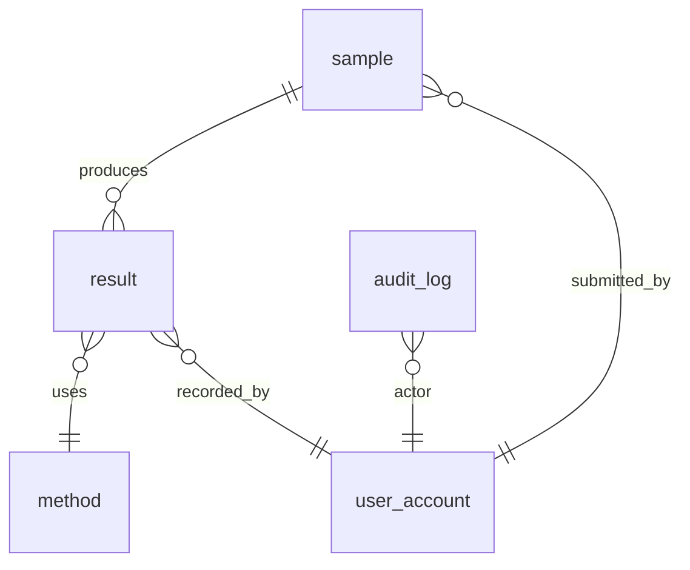

---
# ─── Template metadata (canonical) ──────────────────────────────────────────
title: "DBS — Database Specification (canonical CSV template)"
type: template
template_class: csv
template_id: "DBS"
template_version: "0.1.0"
v_model_phase: design-specification
gamp_categories_applicable: [4, 5]
language: en
status: canonical-draft
created: 2026-05-30
updated: 2026-05-30

# ─── Pipeline (V-Model neighbours) ──────────────────────────────────────────
# DBS realizes the data requirements from FS + URS and feeds IQ (schema baseline) + OQ.
inputs:
  - template_id: "FS"
    required: true
    description: "Approved Functional Specification — source of all FS-DATA-NNN (and FS-EREC-NNN) that this DBS realizes. Without an approved FS there is no valid DBS."
  - template_id: "URS"
    required: true
    description: "Approved User Requirements Specification — source of URS-DATA-NNN, URS-EREC-NNN that this DBS traces to. Needed for full backward traceability in the RTM."
  - template_id: "RA-INIT"
    required: false
    description: "Initial Risk Assessment — scales the level of detail (depth of constraints, retention, audit-trail design) according to risk. Recommended for Cat 4/5 with GxP data."
outputs:
  - artifact: "DBS instance (Markdown)"
    consumed_by:
      - "IQ"          # Installation Qualification — verifies the schema baseline matches DBS
      - "OQ"          # Operational Qualification — verifies data-integrity controls and audit trail
      - "RTM"         # Requirements Traceability Matrix — closes URS/FS → DBS chain
applicable_regulations:
  - "gamp-5"          # §D3 Design Specifications; Appendix D3 (database/configuration design)
  - "eu-annex-11"     # §10 Data storage (accuracy, integrity, availability); §2.4 data-integrity / ALCOA+
  - "21-cfr-part-11"  # §11.10 Controls for closed systems — records, audit trail, retention

# ─── Placeholders (declarative, for instantiation skills) ───────────────────
placeholders:
  system_name:
    type: string
    required: true
    description: "Human-readable name of the system (must match the source FS and URS)"
    example: "QC LIMS at site A"
  system_id:
    type: string
    required: true
    description: "Unique system identifier (same as the source FS and URS)"
  fs_ref:
    type: string
    required: true
    description: "Identifier + version of the FS instance that this DBS realizes"
    example: "FS-PROJ-2026-001 v1.0 (approved)"
  urs_ref:
    type: string
    required: true
    description: "Identifier + version of the URS instance that is the upstream source"
    example: "URS-PROJ-2026-001 v1.0 (approved)"
  gamp_category:
    type: enum
    required: true
    values: [4, 5]
    description: "GAMP 5 category (Cat 4 = configured, Cat 5 = custom). Cat 1-3 do not typically require a separate DBS."
  db_technology:
    type: string
    required: true
    description: "Database engine / technology stack (e.g. PostgreSQL 15, Oracle 19c, SQLite 3.42, MongoDB 7.0)"
    example: "PostgreSQL 15"
  db_author_name:
    type: string
    required: true
  db_author_dept:
    type: string
    required: true
  db_overview:
    type: string
    required: true
    description: "General description of the database: purpose, scope, how it relates to the application, number of main entities, rough scale (rows/day, retention horizon)"
  retention_period:
    type: string
    required: true
    description: "GxP data retention period (years) per applicable regulation / organizational policy"
    example: "Minimum 10 years from batch release (per EU GMP Annex 11 §17 (2011 — confirm 2025 §))"
  archival_medium:
    type: string
    required: true
    description: "Archival medium or system for long-term retention (e.g. WORM storage, validated archival SaaS, export to signed PDF + checksums)"
    example: "Export to encrypted WORM NAS with SHA-256 manifest; annual retrieval test"
  audit_trail_table:
    type: string
    required: true
    description: "Name of the audit-trail table / collection in the schema"
    example: "audit_log"
  org_csv_policy_ref:
    type: string
    required: false
    description: "Reference to the organization's CSV / data governance policy"
  custom_ref:
    type: string
    required: false

# ─── INSTANCE frontmatter spec (not the template's) ─────────────────────────
instance_frontmatter_spec:
  required_fields:
    - title
    - type: "instance"
    - based_on_template: "DBS"
    - based_on_template_version
    - system_id
    - traces_to            # FS instance ID + version that this DBS realizes (primary)
    - status               # draft | in-review | approved | superseded
    - version              # instance's own semver
    - created
    - updated
    - language
  conditional_fields:
    - approved_by: "required if status == approved"
    - supersedes: "version of the previous DBS if this is a new revision"
    - urs_traces_to: "URS instance ID — add when direct URS↔DBS traceability is needed in RTM"

# ─── Validation rules ────────────────────────────────────────────────────────
validation_rules:
  - "All placeholders with required: true must be filled"
  - "traces_to must point to a FS instance with status: approved (GAMP 5: DBS is a design artifact that realizes an approved FS)"
  - "Each DBS schema row must cite at least one upstream FS-DATA-NNN and/or URS-DATA-NNN in the 'Realizes' column"
  - "Audit-trail design section must be present and non-empty if URS-EREC-005 (or any URS-EREC requiring audit trail) is active in the source URS"
  - "Retention period must be stated for every entity/table that holds GxP records"
  - "Each entity/field with a GxP classification must document the classification and its regulatory basis"
  - "Referential integrity constraints must be defined for all foreign-key relationships between GxP entities"
  - "Signature block must include an identified Data Owner (GAMP 5 §6.2.3.1 + M10)"
  - "No URS-DATA-NNN or FS-DATA-NNN with GxP=Y may be left without a DBS-DATA-NNN realizing it (full coverage)"

tags:
  - template
  - csv
  - dbs
  - database-specification
  - data-model
  - v-model
  - cascade
  - canonical
  - audit-trail
  - data-integrity
---

# DBS — Database Specification

> [!note] Canonical CSV template
> **Canonical** template for producing the **Database Specification (DBS)** of a computerized system. The DBS defines the **physical data model** — entities, tables, fields, types, constraints, keys, relationships, retention policy, and data-integrity controls — that realizes the data requirements expressed in the [FS](FS.md) (`FS-DATA-NNN`, `FS-EREC-NNN`) and the [URS](URS.md) (`URS-DATA-NNN`, `URS-EREC-NNN`). Complies with GAMP 5 §D3 (Design Specifications), EU Annex 11 §10 (Data storage) and §2.4 (data integrity / ALCOA+), and 21 CFR Part 11 §11.10. Schema baseline is verified in the **IQ**; data-integrity controls and audit-trail behaviour are verified in the **OQ**.

> [!tip] Embedded usage rules
> 1. **DATA + EREC** — the DBS primarily realizes `FS-DATA-NNN` and `URS-DATA-NNN`. It also realizes `FS-EREC-NNN` / `URS-EREC-NNN` when the EREC control is implemented at the database layer (e.g. append-only audit-trail table, field-level checksums, DB triggers).
> 2. **Mandatory traceability** — each `DBS-DATA-NNN` schema row must cite the upstream `FS-DATA-NNN` (and/or `URS-DATA-NNN`) it realizes. Rows without an upstream citation are orphans and must be justified.
> 3. **Audit-trail non-negotiable** — if `URS-EREC-005` (or any audit-trail EREC requirement) is active, section 6 (Audit-Trail Storage Design) is mandatory and must describe an append-only, immutable mechanism capturing user, timestamp, old value, new value, and reason.
> 4. **Retention on every GxP entity** — every table holding GxP records must state a retention period traceable to a regulation or organizational policy.
> 5. **No-deletion rule** — an obsolete DBS row is struck through (`~~DBS-DATA-007: ...~~`), never deleted. Deleting breaks IQ↔DBS↔RTM traceability.
> 6. **Applicability** — Cat 4 (configured): DBS documents the vendor's delivered schema plus any configuration-time customizations. Cat 5 (custom): DBS documents the full schema designed by the development team.
> 7. **V-Model pairing** — schema baseline is verified in the **IQ** (schema matches DBS); data-integrity controls and audit-trail operation are verified in the **OQ** (functional verification of GxP data behaviour).

---

## 0. Identification and signatures

### System

| Field | Value |
|---|---|
| **System name** | `{{system_name}}` |
| **System identifier** | `{{system_id}}` |
| **FS being realized** | `{{fs_ref}}` *(must be approved)* |
| **URS (upstream source)** | `{{urs_ref}}` *(must be approved)* |
| **Database technology** | `{{db_technology}}` |
| **GAMP category** | `{{gamp_category}}` *(inherited from [Risk Analysis](RA-INIT.md) / URS)* |

### Signatures

| Role | Name | Department | Date | Signature |
|---|---|---|---|---|
| Author | `{{db_author_name}}` | `{{db_author_dept}}` |  |  |
| Reviewer 1 (System Owner / IT / Database Administrator) |  |  |  |  |
| Reviewer 2 (SME / Process Owner) |  |  |  |  |
| Reviewer 3 (Data Owner) *(GAMP 5 §6.2.3.1 + M10)* |  |  |  |  |
| Approver 1 (System Owner) |  |  |  |  |
| Approver 2 (Quality Unit) |  |  |  |  |

> [!note] Who authors the DBS
> Typically the **development team** (Cat 5 custom systems) or the **Supplier / DBA** (Cat 4 configured vendor system). The regulated organization's Data Owner and Quality Unit must review and approve for any GxP-classified entities.

---

## 1. Introduction

This **Database Specification (DBS)** defines the physical data model and data-integrity controls for the system **`{{system_name}}`**. It realizes the data requirements specified in the [FS](FS.md) (`{{fs_ref}}`) and traces back to the [URS](URS.md) (`{{urs_ref}}`). It constitutes the **Design Specification** phase of the CSV V-Model (left-hand side, Design layer) and is verified in the **IQ** (schema baseline) and **OQ** (data-integrity controls, audit-trail behaviour).

**Scope of this DBS**: `{{db_overview}}`

> [!note] Relationship to DS
> For Cat 5 systems, this DBS may be a standalone document or a dedicated section within the [Design Specification (DS)](DS.md). If embedded in the DS, cross-reference the DS doc-ID here. If standalone, the DS should reference this DBS by its doc-ID. Both approaches are accepted; consistency is mandatory.

---

## 2. Definitions and abbreviations

| Term | Definition |
|---|---|
| DBS | Database Specification — the physical data-model document for a GxP computerized system |
| FS | Functional Specification — the technical "how" that realizes the URS; source of FS-DATA-NNN |
| URS | User Requirements Specification — the "what" from the user's perspective; source of URS-DATA-NNN / URS-EREC-NNN |
| IQ | Installation Qualification — verifies the database schema is installed as specified in this DBS |
| OQ | Operational Qualification — verifies data-integrity controls and audit-trail function as specified |
| Entity | A discrete, identifiable object whose data the system manages (maps to a table in a relational DB) |
| Audit trail | An append-only, chronological, tamper-evident record of create/modify/delete events on GxP records |
| GxP record | Any electronic record subject to regulatory requirements (EU Annex 11 §10, 21 CFR Part 11 §11.10) |
| Referential integrity | DB-enforced constraint ensuring foreign-key relationships are always valid |
| ALCOA+ | Attributable, Legible, Contemporaneous, Original, Accurate + Complete, Consistent, Enduring, Available (data-integrity standard) |
| GAMP 5 | Good Automated Manufacturing Practice 5, ISPE 2022 |
| EU Annex 11 | EU GMP — Computerised Systems (EudraLex Volume 4) |
| 21 CFR Part 11 | FDA — Electronic Records; Electronic Signatures |
|  |  |

---

## 3. System overview and database context

`{{db_overview}}`

### 3.1 Database technology and environment

| Parameter | Value |
|---|---|
| **Database engine** | `{{db_technology}}` |
| **Deployment model** | *(e.g. on-premises / cloud-managed / containerized)* |
| **High-availability / replication** | *(e.g. primary + read replica, synchronous streaming replication)* |
| **Backup strategy** | *(e.g. daily full + hourly incremental, 30-day on-site + 90-day off-site)* |
| **Encryption at rest** | *(e.g. AES-256 TDE; key management via HSM)* |
| **Encryption in transit** | *(e.g. TLS 1.3 enforced for all client connections)* |

### 3.2 GxP data classification summary

| GxP Class | Definition | Retention | Applicable regulation |
|---|---|---|---|
| **GxP-Critical** | Records whose inaccuracy or loss could directly impact product quality, patient safety, or regulatory compliance | `{{retention_period}}` | EU Annex 11 §10; 21 CFR Part 11 §11.10(c) |
| **GxP-Supporting** | Records that support GxP activities but whose loss would not directly compromise product release | Define per entity | EU Annex 11 §10 |
| **Non-GxP** | Administrative / operational records with no regulatory retention requirement | Per organizational policy | — |

---

## 4. Entity / data-model overview

> [!tip] Purpose of this section
> Describe the entities (tables/collections) at a conceptual level before the detailed schema tables in section 5. Include an entity-relationship (ER) diagram if available. This section is the narrative anchor; section 5 is the detailed specification.

### 4.1 Entity list

| Entity / Table | Purpose | GxP Class | Primary key type |
|---|---|---|---|
| *(e.g.)* `sample` | Represents a physical sample submitted for analysis | GxP-Critical | UUID (auto-generated) |
| *(e.g.)* `result` | Analytical result linked to a sample and a method | GxP-Critical | UUID |
| *(e.g.)* `audit_log` | Append-only audit trail for GxP-Critical record events | GxP-Critical (audit) | Sequence / auto-increment |
| *(e.g.)* `user_account` | Application user with role and access details | GxP-Supporting | UUID |
| *(e.g.)* `method` | Reference data: analytical method definition | GxP-Supporting | UUID |
|  |  |  |  |

### 4.2 Entity-relationship summary

> Attach an ER diagram (image embed or Mermaid block) below. At minimum, describe the key relationships in prose.

```
[NEEDS CLARIFICATION: insert ER diagram or Mermaid ERD here]
```

*(Example Mermaid ERD:)*



---

## 5. Schema specification (DBS requirement table)

> [!warning] Mandatory traceability
> Every row in this table must cite the upstream `FS-DATA-NNN` and/or `URS-DATA-NNN` it realizes. Rows without an upstream citation are **orphan entries** and block approval. Rows that realize `URS-EREC-NNN` audit-trail requirements should appear in **both** this section and section 6.

### Schema table format

| DBS-ID | Realizes (FS / URS ID) | Entity / Table | Field | Type | Constraint / Default | GxP Class | Justification |
|---|---|---|---|---|---|---|---|
| `DBS-DATA-001` | `FS-DATA-001` / `URS-DATA-001` | `sample` | `sample_id` | `UUID` | PRIMARY KEY, NOT NULL, auto-generated | GxP-Critical | Unique, immutable identifier required for ALCOA+ attributability |
| `DBS-DATA-002` | `FS-DATA-001` / `URS-DATA-001` | `sample` | `sample_code` | `VARCHAR(64)` | NOT NULL, UNIQUE | GxP-Critical | Human-readable sample code; uniqueness enforced at DB level |
| `DBS-DATA-003` | `FS-DATA-001` / `URS-DATA-002` | `sample` | `submitted_by` | `UUID` | NOT NULL, FK → `user_account.user_id` | GxP-Critical | Attributability (ALCOA+ A): every record links to an identified user |
| `DBS-DATA-004` | `FS-DATA-001` / `URS-DATA-002` | `sample` | `submitted_at` | `TIMESTAMPTZ` | NOT NULL, server-side default `NOW()` | GxP-Critical | Contemporaneity (ALCOA+ C): NTP-synchronized server timestamp |
| `DBS-DATA-005` | `FS-DATA-001` / `URS-DATA-003` | `sample` | `status` | `VARCHAR(32)` | NOT NULL, CHECK IN ('pending','in-analysis','completed','invalidated') | GxP-Critical | Controlled vocabulary; prevents invalid state transitions |
| `DBS-DATA-006` | `FS-DATA-002` / `URS-DATA-004` | `result` | `result_id` | `UUID` | PRIMARY KEY, NOT NULL, auto-generated | GxP-Critical | Immutable primary key |
| `DBS-DATA-007` | `FS-DATA-002` / `URS-DATA-004` | `result` | `sample_id` | `UUID` | NOT NULL, FK → `sample.sample_id` | GxP-Critical | Referential integrity: result cannot exist without a parent sample |
| `DBS-DATA-008` | `FS-DATA-002` / `URS-DATA-004` | `result` | `value` | `NUMERIC(18,6)` | NOT NULL | GxP-Critical | Analytical result value; precision defined per method |
| `DBS-DATA-009` | `FS-DATA-002` / `URS-DATA-005` | `result` | `unit` | `VARCHAR(32)` | NOT NULL | GxP-Critical | Unit of measure; part of the result's complete identity |
| `DBS-DATA-010` | `FS-DATA-002` / `URS-DATA-005` | `result` | `recorded_by` | `UUID` | NOT NULL, FK → `user_account.user_id` | GxP-Critical | Attributability |
| `DBS-DATA-011` | `FS-DATA-002` / `URS-DATA-005` | `result` | `recorded_at` | `TIMESTAMPTZ` | NOT NULL, server-side default `NOW()` | GxP-Critical | Contemporaneity |
| `DBS-DATA-012` | `FS-EREC-005` / `URS-EREC-005` | `audit_log` | `log_id` | `BIGSERIAL` | PRIMARY KEY, NOT NULL | GxP-Critical (audit) | Immutable sequential key; see section 6 for full audit-trail design |
| `DBS-DATA-013` | `FS-DATA-003` / `URS-DATA-006` | `method` | `method_id` | `UUID` | PRIMARY KEY, NOT NULL | GxP-Supporting | Stable reference for analytical methods |
| `DBS-DATA-014` | `FS-DATA-003` / `URS-DATA-006` | `method` | `method_name` | `VARCHAR(255)` | NOT NULL, UNIQUE | GxP-Supporting | Human-readable method name; uniqueness enforced |
|  |  |  |  |  |  |  |  |

> [!note] Extending this table
> Add one row per field in the schema. Use sequential `DBS-DATA-NNN` IDs. For fields that implement audit-trail controls (section 6), use `DBS-DATA-NNN` citing `FS-EREC-NNN` / `URS-EREC-NNN`. For index / sequence / partition definitions that have no direct URS/FS requirement, cite `FS-DATA-NNN` (the parent entity row) and note "supporting structure".

---

## 6. Audit-trail storage design

> [!warning] Mandatory if URS-EREC-005 (or any audit-trail EREC) is active
> This section must be non-empty if any `URS-EREC-NNN` requiring an audit trail is active in the source URS. An absent audit-trail design is a blocking gap that prevents DBS approval.

### 6.1 Regulatory basis

Per 21 CFR Part 11 §11.10(e) and EU Annex 11 §10 (data storage / integrity; audit-trail review by independent personnel per §12.6):
- The system shall generate **secure, computer-generated, time-stamped audit trails** that independently record date, time, operator, and the old and new values for any create, modify, or delete action on GxP records.
- Audit-trail records shall be **retained for the same period as the associated GxP record** (minimum `{{retention_period}}`).
- Audit-trail records shall **not be modifiable or deletable** by any end user.

### 6.2 Audit-trail table schema — `{{audit_trail_table}}`

Realizes: `FS-EREC-005` / `URS-EREC-005` (and any additional `URS-EREC-NNN` requiring audit trail).

| Field | Type | Constraint | Description |
|---|---|---|---|
| `log_id` | `BIGSERIAL` | PRIMARY KEY, NOT NULL | Immutable monotonically increasing ID; gaps indicate tampering |
| `event_timestamp_utc` | `TIMESTAMPTZ` | NOT NULL, server-side `NOW()` | NTP-synchronized UTC timestamp of the event (Contemporaneous — ALCOA+ C) |
| `actor_user_id` | `UUID` | NOT NULL, FK → `user_account.user_id` | User who performed the action (Attributable — ALCOA+ A) |
| `actor_role` | `VARCHAR(128)` | NOT NULL | Role of the actor at time of action (captured at event time, not current role) |
| `target_table` | `VARCHAR(128)` | NOT NULL | Name of the table where the record was affected |
| `target_record_id` | `UUID` | NOT NULL | Primary key of the affected record |
| `action` | `VARCHAR(16)` | NOT NULL, CHECK IN ('INSERT','UPDATE','DELETE') | Type of data event |
| `field_name` | `VARCHAR(128)` | NULL (NULL for INSERT/DELETE of whole record) | Name of the field changed (for UPDATE events) |
| `old_value` | `TEXT` | NULL | Previous value as text (Original — ALCOA+ O); NULL for INSERT |
| `new_value` | `TEXT` | NULL | New value as text; NULL for DELETE |
| `reason` | `TEXT` | NULL (required at application layer for UPDATE/DELETE on GxP-Critical) | Reason for change entered by the actor (Good Documentation Practice) |
| `session_id` | `UUID` | NULL | Application session identifier for correlation |
| `source_ip` | `INET` | NULL | Source IP address of the client at time of action |

### 6.3 Append-only enforcement

The audit-trail table is **append-only** and **immutable** at the database permission layer:

| Control | Implementation |
|---|---|
| No UPDATE on audit rows | DB role used by the application has `INSERT` only on `{{audit_trail_table}}`; `UPDATE`/`DELETE` are revoked |
| No DELETE on audit rows | Same role restriction; physical deletion is architecturally impossible for application accounts |
| DB trigger enforcement | `AFTER INSERT OR UPDATE OR DELETE` triggers on each GxP-Critical table write to `{{audit_trail_table}}`; trigger fires even if the application layer fails to log |
| DBA emergency access | Documented in the [Validation Plan](VP.md); any DBA action on production data generates a `CC` record and a manual audit entry |
| Integrity verification | Periodic `IQ-TC-NNN` / `OQ-TC-NNN` test reads the audit log and verifies `log_id` is monotonically gapless |

### 6.4 ALCOA+ mapping

| ALCOA+ Principle | Implementation in this DBS |
|---|---|
| **A** — Attributable | `actor_user_id` + `actor_role` on every audit row; FK to `user_account` enforces that only identified users can generate events |
| **L** — Legible | All values stored as `TEXT`; rendering to human-readable format is the application layer's responsibility |
| **C** — Contemporaneous | `event_timestamp_utc` set by the server (NTP-synchronized) at trigger execution time; application clock cannot override |
| **O** — Original | `old_value` captures the value at the exact moment before the change; stored as text snapshot (not a reference) |
| **A** — Accurate | DB triggers fire after committed transactions; no partial/uncommitted data is logged |
| **+** Complete | All GxP-Critical tables are covered by triggers; gaps in coverage are a blocking IQ finding |
| **+** Consistent | Single audit table for all entities; uniform schema regardless of which table was modified |
| **+** Enduring | Audit rows share the retention policy of the associated GxP records (`{{retention_period}}`); see section 7 |
| **+** Available | Audit log is in the same DB cluster with identical HA / backup configuration; accessible to QA / auditors via read-only DB role |

---

## 7. Retention and archival

> [!warning] Retention must be stated per GxP entity
> Every table classified GxP-Critical or GxP-Supporting must have an explicit retention period. "Same as paper records" is not sufficient — state the duration and regulatory basis.

| Entity / Table | GxP Class | Retention period | Retention trigger | Regulatory basis | Archival mechanism |
|---|---|---|---|---|---|
| *(e.g.)* `sample` | GxP-Critical | `{{retention_period}}` | Date of batch release / study closure | EU Annex 11 §17 (2011 — confirm 2025 §); 21 CFR Part 11 §11.10(c) | `{{archival_medium}}` |
| *(e.g.)* `result` | GxP-Critical | `{{retention_period}}` | Date of batch release / study closure | EU Annex 11 §17 (2011 — confirm 2025 §); 21 CFR Part 11 §11.10(c) | `{{archival_medium}}` |
| *(e.g.)* `{{audit_trail_table}}` | GxP-Critical (audit) | Same as associated GxP records | Date of last associated GxP record | 21 CFR Part 11 §11.10(e); EU Annex 11 §10 | `{{archival_medium}}` |
| *(e.g.)* `method` | GxP-Supporting | Duration of any result referencing the method + `{{retention_period}}` | Date of last result using the method | EU Annex 11 §17 (2011 — confirm 2025 §) | `{{archival_medium}}` |
| *(e.g.)* `user_account` | GxP-Supporting | Lifecycle of the system + 2 years post-decommission | Decommission date | EU Annex 11 §11.6 (access management) | `{{archival_medium}}` |
|  |  |  |  |  |  |

### 7.1 Archival procedure

`{{archival_medium}}`

At archival:

1. Export GxP-Critical records + associated audit-log rows to a format readable without the original application (e.g. structured CSV / JSON + data dictionary).
2. Generate a SHA-256 manifest covering all exported files.
3. Store on `{{archival_medium}}` with the manifest and an evidence record (`BRR` or `CC`).
4. Perform a **retrieval test** at least annually to verify archived data remains accessible and intact.
5. Document the archival event in the system's [Periodic Review](PR.md) record.

---

## 8. Data-integrity controls

> [!tip] This section covers controls implemented at the database layer (referential integrity, validation constraints, checksums). Application-layer controls are specified in the [FS](FS.md) (FS-EREC / FS-SEC sections).

### 8.1 Referential integrity

| Relationship | FK field | Parent table | ON DELETE | ON UPDATE | Justification |
|---|---|---|---|---|---|
| `result.sample_id` → `sample.sample_id` | `sample_id` | `sample` | RESTRICT | CASCADE | A result cannot exist without a parent sample; cascade update preserves data consistency |
| `result.recorded_by` → `user_account.user_id` | `recorded_by` | `user_account` | RESTRICT | CASCADE | Attributability requires a valid user reference |
| `audit_log.actor_user_id` → `user_account.user_id` | `actor_user_id` | `user_account` | RESTRICT | CASCADE | Audit trail must always reference a valid user |
| `result.method_id` → `method.method_id` | `method_id` | `method` | RESTRICT | CASCADE | Result must reference a valid analytical method |
|  |  |  |  |  |  |

### 8.2 Data validation constraints

| Table | Field | Constraint type | Constraint expression | Justification |
|---|---|---|---|---|
| `sample` | `status` | CHECK | `status IN ('pending','in-analysis','completed','invalidated')` | Controlled vocabulary; prevents invalid status values |
| `result` | `value` | NOT NULL + type | `NUMERIC(18,6) NOT NULL` | Non-null analytical value with defined precision |
| `audit_log` | `action` | CHECK | `action IN ('INSERT','UPDATE','DELETE')` | Only recognized DML events are logged |
|  |  |  |  |  |

### 8.3 Record-level checksum (if applicable)

> [!note] Include this sub-section only if URS-EREC-001 (record integrity via checksum) is active.

| Table | Checksum field | Algorithm | When computed | Verification |
|---|---|---|---|---|
| *(e.g.)* `result` | `record_hash` | SHA-256 over canonical JSON of `(result_id, sample_id, value, unit, recorded_by, recorded_at)` | On INSERT by DB trigger; recomputed on every OQ read-back test | `OQ-TC-NNN`: modify `value` directly in DB → verify `record_hash` no longer matches recomputed value |
|  |  |  |  |  |

### 8.4 Soft-delete vs. hard-delete policy

> [!warning] Hard deletion of GxP records is prohibited under EU Annex 11 §10 and 21 CFR Part 11 §11.10.

| Entity / Table | Deletion policy | Mechanism | Audit trail entry |
|---|---|---|---|
| GxP-Critical entities (e.g. `sample`, `result`) | **Soft-delete only** — records are marked `invalidated`; rows are never physically deleted | `status = 'invalidated'` field + UPDATE triggers an `audit_log` INSERT | Required: `action='UPDATE'`, `field_name='status'`, `old_value='...'`, `new_value='invalidated'`, `reason` mandatory |
| Reference/lookup data (e.g. `method`) | **Soft-delete** (deprecation flag) | `is_deprecated BOOLEAN DEFAULT FALSE` | Required |
| Non-GxP operational data | Hard-delete permitted | Standard `DELETE` | Optional (best practice: log) |

---

## 9. DBS → IQ / OQ traceability

> [!tip] This table maps each DBS schema element to its verification test case. It is the downstream side of the traceability chain: `URS → FS → DBS → IQ/OQ`.

| DBS-ID | Entity / Field | Verified in | Test ID | What is verified |
|---|---|---|---|---|
| `DBS-DATA-001` | `sample.sample_id` | IQ | `IQ-TC-NNN` | Schema matches DBS: field exists, type = UUID, PRIMARY KEY |
| `DBS-DATA-012` | `audit_log.log_id` | IQ + OQ | `IQ-TC-NNN`, `OQ-TC-NNN` | IQ: table exists, schema matches. OQ: trigger fires on `sample` UPDATE; log row created with correct old/new values |
| *(All DBS-DATA-NNN)* | *(Entity / Field)* | IQ | `IQ-TC-NNN` | Schema deployed matches DBS specification row-by-row |
| *(GxP-Critical DBS rows)* | *(GxP fields)* | OQ | `OQ-TC-NNN` | Data-integrity controls and constraints enforce as specified |
|  |  |  |  |  |

---

## 10. Related documents

| Document | Reference |
|---|---|
| FS realized by this DBS | `{{fs_ref}}` ([FS](FS.md)) |
| URS upstream source | `{{urs_ref}}` ([URS](URS.md)) |
| Design Specification (Cat 5, if separate) | [DS](DS.md) *(if applicable)* |
| Installation Qualification | [IQ](IQ.md) |
| Operational Qualification | [OQ](OQ.md) |
| Requirements Traceability Matrix | [RTM](RTM.md) |
| Organization's CSV / data governance policy | `{{org_csv_policy_ref}}` |
| Validation Plan | [VP](VP.md) |
| `{{custom_ref}}` |  |

---

## 11. Revision history

| Version | Date | Reason for revision / Author |
|---|---|---|
| 01 | DD.MM.YYYY | Initial issue — `{{db_author_name}}`, `{{db_author_dept}}` |
|  |  |  |

---

## Canonical notes for implementers

> [!note] The DBS is the data-layer anchor of the V-Model
> Each `DBS-DATA-NNN` cites a `FS-DATA-NNN` (or `URS-DATA-NNN`); the **IQ** verifies the deployed schema matches this DBS; the **OQ** verifies that GxP data controls (constraints, triggers, audit trail) behave as specified. This chain closes the data traceability loop: `URS-DATA → FS-DATA → DBS-DATA → IQ-TC / OQ-TC`. *(GAMP 5 §D3 and EU Annex 11 §10.)*

> [!note] Category-awareness — DBS depth by GAMP category
> - **Cat 4** (configured vendor product): DBS documents the vendor's delivered schema (from vendor documentation) plus any customer-configurable fields or extensions. Schema changes from the standard product baseline must be flagged.
> - **Cat 5** (custom software): DBS documents the full schema designed by the development team. This is a first-party design document; every table and field must be justified against an upstream FS / URS requirement.

> [!note] Audit trail — the minimum non-negotiable
> Even if the regulatory context does not mandate 21 CFR Part 11 electronic records, **any system managing GxP data** benefits from an append-only audit trail at the DB layer. The schema pattern in section 6 is portable across PostgreSQL, Oracle, SQL Server, and MySQL (with minor syntax variations). For NoSQL / document stores, the pattern maps to an immutable `audit_events` collection.

> [!tip] Natural output of this template
> A well-written DBS produces the **data layer** of the traceability matrix: `URS-DATA → FS-DATA → DBS-DATA → IQ-TC` (schema verification) + `OQ-TC` (data-integrity verification). Section 9 is the master index of that downstream traceability.

## Related

- [FS](FS.md) · [URS](URS.md) · [DS](DS.md) · [IQ](IQ.md) · [OQ](OQ.md) · [RTM](RTM.md)
- GAMP 5 · 21 CFR Part 11 · EU Annex 11
- data integrity · audit trail · ALCOA+ · V-Model

---

## Instantiation flow (for AI agents)

> [!note] This section is NOT copied into the instance. It is guidance for the `gdd.dbs.from-fs` skill.

### Pre-flight

1. **Read `.gxp-dev.yaml`** from the consumer project. If it does not exist → redirect to `/gdd.init`.
2. **Locate the approved FS instance** (`specs/FS.md`). If it does not exist or status != approved → **stop**: the DBS realizes an approved FS. Inform the user.
3. **Locate the approved URS instance** (`specs/URS.md`). If it does not exist or status != approved → **stop**: full backward traceability requires an approved URS. Inform the user.
4. **Read `templates/csv/DBS.md`** from the toolkit as the source template (this file).
5. **Read RA-INIT if it exists** — scales the level of detail (depth of constraints, checksums, audit design) according to risk classification.

### Generation flow (cascade from FS + URS)

1. **Parse all `FS-DATA-NNN`** and **`URS-DATA-NNN`** from the approved FS and URS, with their GxP class and priority.
2. **Parse active `FS-EREC-NNN` / `URS-EREC-NNN`** to identify audit-trail and data-integrity controls that must be implemented at the DB layer.
3. **For each `FS-DATA-NNN` / `URS-DATA-NNN`**, propose one or more `DBS-DATA-NNN` schema rows:
   - Map each data requirement to one or more tables / fields.
   - Specify type, constraint, GxP class, and justification.
   - Cite the upstream `FS-DATA-NNN` and/or `URS-DATA-NNN` in the "Realizes" column.
4. **If `URS-EREC-005` or any audit-trail EREC is active** → generate section 6 (Audit-Trail Storage Design) with the canonical `audit_log` schema and ALCOA+ mapping. This is mandatory and non-negotiable.
5. **Generate section 7** (Retention and Archival) — derive retention from the URS-ARCH or URS-EREC requirements; flag `[NEEDS CLARIFICATION: retention_period]` if not specified in the source URS.
6. **Generate section 8** (Data-Integrity Controls) — derive referential integrity constraints from the entity relationships identified in step 3; derive validation constraints from URS-DATA business rules.
7. **Generate section 9** (DBS → IQ/OQ traceability) — map each `DBS-DATA-NNN` to the IQ test case that will verify it (schema baseline); map GxP-Critical rows to OQ test cases for data-integrity verification.
8. **Anti-hallucination**: insert `[NEEDS CLARIFICATION: ...]` when there is insufficient information to specify a field type, constraint, or retention period. Never invent regulatory citations or §-numbers.
9. **Output**: write `specs/DBS.md` (status: draft); print summary including: entity count, DBS-DATA-NNN count, audit-trail present (Y/N), % of FS-DATA coverage.
10. **Post-flight**: run `validate-frontmatter.py` + `check-clarification-markers.py` + `generate-rtm.py` (to verify FS-DATA → DBS-DATA coverage).

### Stop criteria ("complete" instance)

- [ ] `traces_to` points to a FS instance with status: approved
- [ ] All `FS-DATA-NNN` with GxP=Y have ≥1 `DBS-DATA-NNN` realizing them (full coverage)
- [ ] No `FS-DATA-NNN` with prio=H is left without a DBS realization (0 blocking gaps)
- [ ] Each `DBS-DATA-NNN` cites its upstream FS/URS ID in the "Realizes" column
- [ ] If `URS-EREC-005` or any audit-trail EREC is active → section 6 is non-empty with full audit-log schema and ALCOA+ mapping
- [ ] Retention period is stated for every GxP-Critical and GxP-Supporting entity
- [ ] Referential integrity constraints defined for all FK relationships between GxP entities
- [ ] Soft-delete policy documented for all GxP-Critical entities
- [ ] Section 9 (DBS → IQ/OQ traceability) populated
- [ ] Signature block with ≥1 author + reviewers (incl. Data Owner) + approvers

### `status` transitions

```
draft ──[full FS-DATA coverage + audit-trail present if EREC active + 0 H gaps]──> in-review
in-review ──[approver signatures applied]──> approved
approved ──[new version issued]──> superseded
```

### Downstream mapping — how the DBS traces to IQ / OQ / RTM

| Origin (DBS) | Destination | Cardinality | Rule |
|---|---|---|---|
| `DBS-DATA-NNN` (all rows) | `IQ-TC-NNN` in `IQ.md` | 1:1 to 1:N | IQ verifies each schema element is deployed as specified (schema baseline) |
| `DBS-DATA-NNN` (GxP-Critical) | `OQ-TC-NNN` in `OQ.md` | 1:N | OQ verifies data-integrity controls, constraints, and audit-trail triggers operate correctly |
| `DBS-DATA-NNN` | Row in `RTM.md` | 1:1 | RTM closes the chain URS-DATA → FS-DATA → DBS-DATA → IQ-TC / OQ-TC |
| Audit-trail design (section 6) | `OQ-TC-NNN` (audit-trail tests) | 1:N | OQ verifies audit trail fires on INSERT/UPDATE/DELETE, captures correct old/new/user/timestamp/reason |
